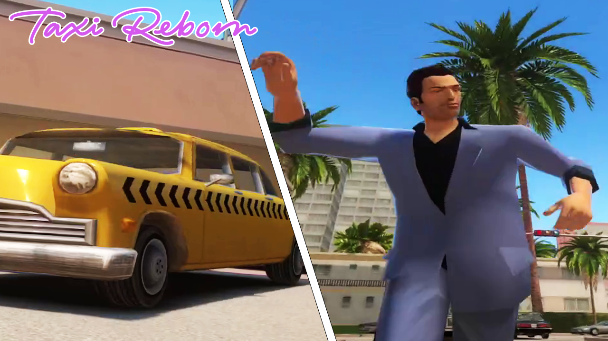
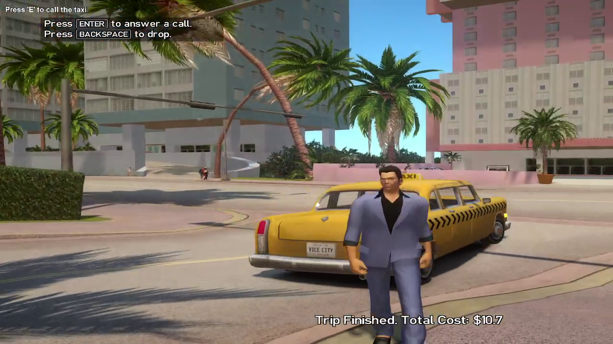

## GTA ViceCity Next-Gen Mod: Fixes and Enhancements

This repo contains improvements and fixes for GTA Vice City Next Gen Mod by RevTeam. Some Scripthook mods can work in original GTA IV Game, others not.

### Improvements (Scripthook):
For improvements (new feature that was not in GTA VC original game), i choose to use Scripthook.  
To install you need to:
 ```
    - Download Scripthook for 1.0.7.0;
    - Find your game folder;
    - Drag and drop the files;
    - Copy TaxiReborn_xxx.cs to your scripts folder in game main folder.
 ```

 ### Improvements List:
 #### 1. Taxi Reborn (BETA) (src/Improments/TaxiReborn_x.x.x/TaxiReborn.cs)
The player can now (again) use a Taxi. You can skip the ride. If your money is lower than the trip value, may be have consequences.I rewrite from scratch this feature, so can be a few bugs. Feel free to report then in POST section (Nexus) or in Issues section (GITHUB).

[Showcase](https://www.youtube.com/watch?v=JH-5HKLd8iI)

[](https://www.youtube.com/watch?v=JH-5HKLd8iI)



### Fixes:
For fixes i honest choose to use the sco language.  
To install you need to:
 ```
    - Download and open OpenIV;
    - Find your game folder;
    - In OpenIV to common/data/cdimages/script.img;
    - Enable EditMode, drag and drop the <filename>.c in script.img folder;
    - The Program saves automatically;
 ```

 ### Fixes List:
 #### 1. mob_phone.c (src/Fixes/script.img/mob_phone.cs)
Player Can't Change Weapon while is talking on the phone. I fix this disabling calling the native function ```TASK_PLAY_ANIM_NON_INTERRUPTABLE``` and set player unarmed. The bad about this is that player can't move (if walks).
 The fix don't need to be set if player is in vehicle.
 
```
void set_anim_in(void)
{
	REQUEST_ANIMS( "cellphone" );
	while (!HAVE_ANIMS_LOADED( "cellphone" )) WAIT(0);
	
	ATTACH_OBJECT_TO_PED( trubka_1, GetPlayerPed(), 1232, 0.070, 0.052, 0.003, 3.30000000, 0.30000000, -0.45000000, 0 );
	//DisablePlayerControls(1);
	SET_CURRENT_CHAR_WEAPON(GetPlayerPed(), WEAPON_UNARMED, TRUE);
	TASK_PLAY_ANIM_SECONDARY_UPPER_BODY( GetPlayerPed(), "cellphone_in", "cellphone", 8.0, 0, 0, 0, 1, -1 );//
	WAIT(1000);
	if (IS_CHAR_SITTING_IN_ANY_CAR(GetPlayerPed()))
	{
		SET_CURRENT_CHAR_WEAPON(GetPlayerPed(), WEAPON_UNARMED, TRUE);
		TASK_PLAY_ANIM_SECONDARY_UPPER_BODY( GetPlayerPed(), "cellphone_talk", "cellphone", 8.0, 1, 0, 0, 0, -1 );
	} 
	else
	{
		SET_CURRENT_CHAR_WEAPON(GetPlayerPed(), WEAPON_UNARMED, TRUE);
		TASK_PLAY_ANIM_NON_INTERRUPTABLE( GetPlayerPed(), "cellphone_talk",  "cellphone", 8.0, 1, 0, 0, 0, -1 );
	}
	incoming_call = 1;
}

```
```
void set_anim_out(void)
{
	SET_CURRENT_CHAR_WEAPON(GetPlayerPed(), WEAPON_UNARMED, TRUE);

    ...
}
```

### Credits:
- Made by me; For use, give the credits;
- RevolutionTeam to GTAVCNG mod;
- Alexander's Blade;
